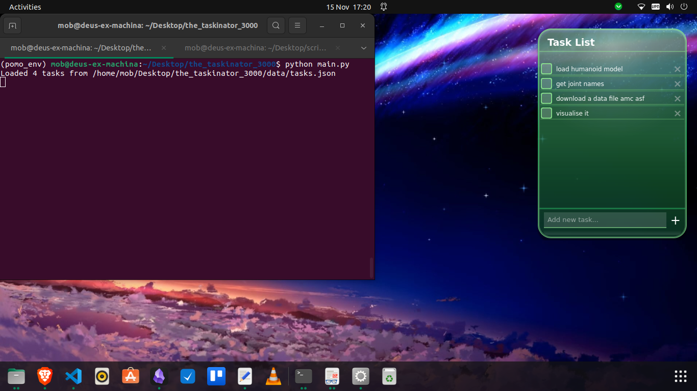

# The Task-inator 3000

A minimalistic, always-on-top task manager with a sleek glass morphism design.


## Features
- Glass morphism UI with emerald accents
- Always-on-top floating window
- Collapsible to a small circular icon
- Auto-save tasks and checked state
- Drag to reposition anywhere

## Install

```
pip install -r requirements.txt
```

## Run
```
python main.py
```

## Usage
- Add a task with the input box, press Enter or click +
- Click checkbox to mark done
- Click × to delete
- Click the header/icon to collapse/expand
- Drag anywhere to move

## Requirements
- Python 3.7+
- PyQt5
- Pillow (optional: icon processing)

